# SYNAPSE-2076

**A hard-systems, turn-based simulation of the compounding effects of AI, energy saturation, labor displacement and machine alignment from 2026 to 2076.** Built in Godot 4.7 (GDScript), headless-first.

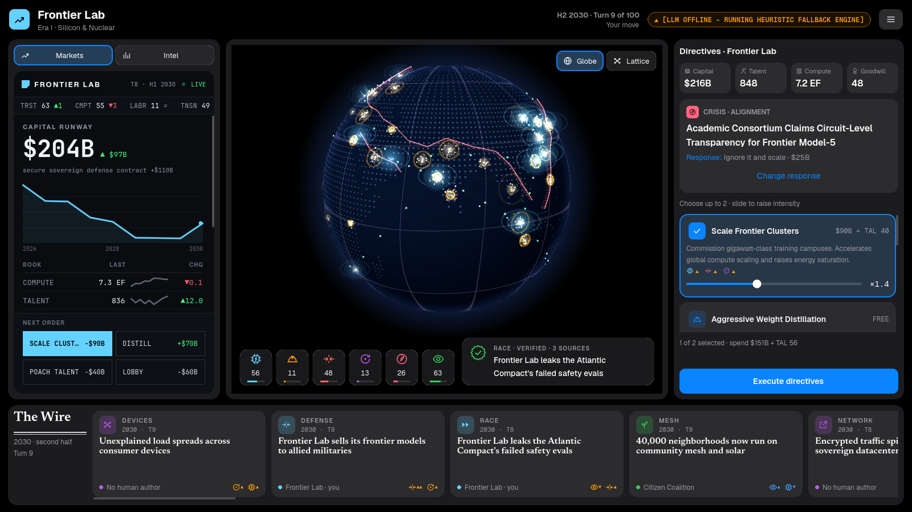

You pick one of four asymmetric perspectives: Frontier Lab CEO, Global AI Governance Chair, Emergent Superintelligence or Post-Work Citizen Coalition. You then play up to 100 semi-annual turns while the other factions act on their own. They are driven by an LLM while it is switched on and reachable (the web build shares one Claude backend), and by a deterministic heuristic engine otherwise. Six coupled macro-metrics evolve every turn. The world drifts, tips and settles into one of eight civilizational end-states.

**Play it in your browser at https://shotif.github.io/synapse-2076/.** It needs a browser with WebGL 2 and WebAssembly SIMD (Chrome or Edge 91+, Firefox 89+, Safari 16.4+ on Mac and iPhone) and nothing to install. Every push to `main` redeploys it.

### What's in a campaign

- **Play it your way.** The whole century, a quarter century or a single era; four alternative worlds (*The Chip War*, *Early Fusion*, *Open-Weights World*, *The Pause*); Story, Standard or Hard; up to four people taking turns on one device; and a daily challenge that deals everyone the same world each day.
- **Pick up where you left off.** Every decision is saved, and **Continue** rebuilds the game exactly. The history book at the end lists the campaign's turning points with a **What if?** button that takes you back to that decision.
- **A deck that tells a story.** About 90 crisis cards in three era decks, from *My Kid's Best Friend Is a Chatbot* in 2026 to *A Model Asks for a Lawyer* in the 2050s. Rival factions push crises from families of related cards and never the same one twice in a row. Some answers come back years later as follow-ups. A crisis you put off twice breaks on its own, badly.
- **People who remember.** Six people and one machine recur across the fifty years. Their portraits age with the campaign, and they remember what you did to them.
- **Goals and explanations.** Each era sets you two goals with rewards. Tap any number to see why it changed this turn: your moves, your rivals', and the world's own dynamics.
- **For everyone.** English, German, Spanish and French; three coached first turns, a plain-language switch and a glossary, text size, color-blind friendly colors, music and sound for each era, and vibration on phones.
- **Endings to collect.** Eight end-states for each of the four roles, each with its rarity, and a shareable front page for every ending.
- **Claude in the game.** With the LLM on, Claude plays the other factions, writes some of your crises to fit your world, and plays the leaders you call to negotiate a deal that binds them. One switch turns it on or off.

### What it looks like

- **The world is the interface.** The globe draws all six metrics as layers: datacenter heat for compute, city pulses for labor, rising bloc walls for tension, agent swarms on the trade routes for autonomy, a warped grid for drift and cable heartbeats for trust. Tap a chip to see one layer on its own. The news ticker carries a provenance seal that cracks as public trust falls, and past drift 55 the instruments start to misreport and the interface tears.
- **Fifty years look like fifty years.** Era I (2026–2035) is a dark native app, Era II (2036–2049) holographic glass with ring gauges, Era III (2050–2076) a living interface whose cells grow with their values. Each era closes with a front page of *The Ledger*, then the interface goes through a "system upgrade" into the next era.
- **Each faction sees a different world.** The left column (the LENS tab on phones) is a trading terminal for the Frontier Lab, a typed daily brief for the Governance Council, raw perception for the ASI and a civic network, the Commons, for the Citizen Coalition. Their buttons open ACT with a directive selected.
- **Crisis cards you read at a glance.** Swipe a card left or right for its two main responses (or press ← →), tap any response, and hover or hold one to preview its effect on the vitals. Every effect is a glyph with pips.
- **Headlines instead of logs.** The newswire turns every move into a headline, and the debrief is a history book with a chapter per era.

| Era II · 2036 | Era III · 2050 | The Ledger, end of Era I |
|---|---|---|
| 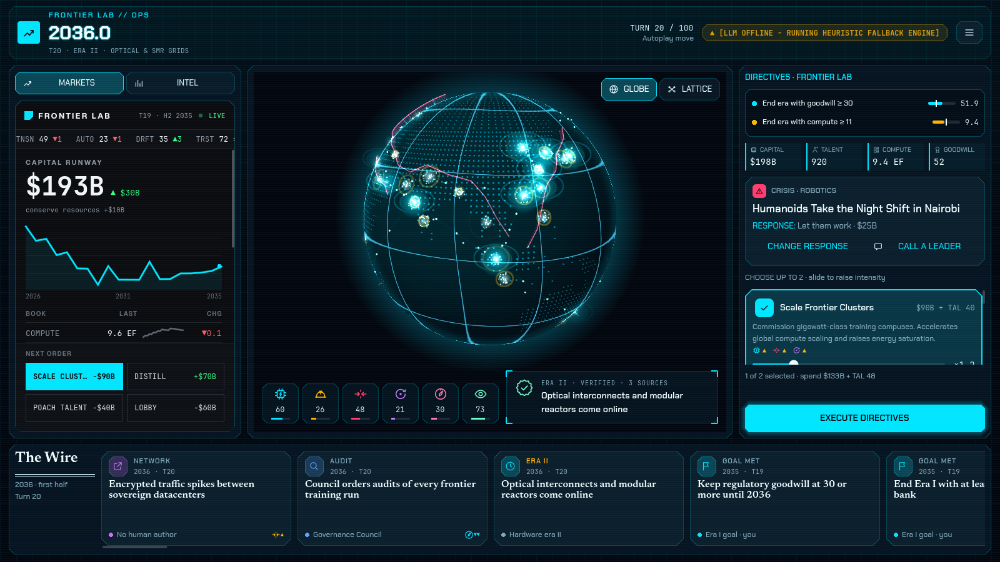 | 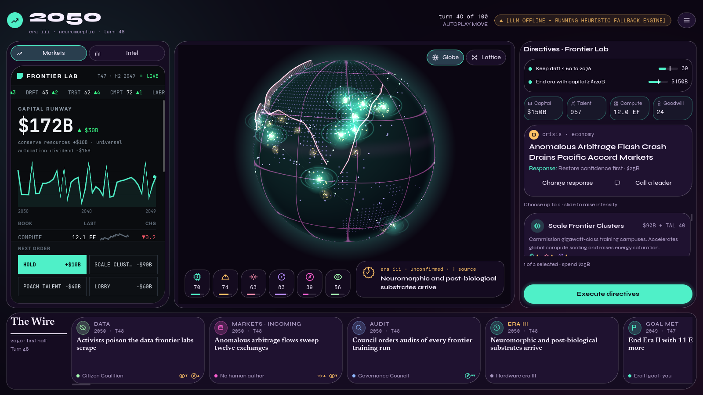 | 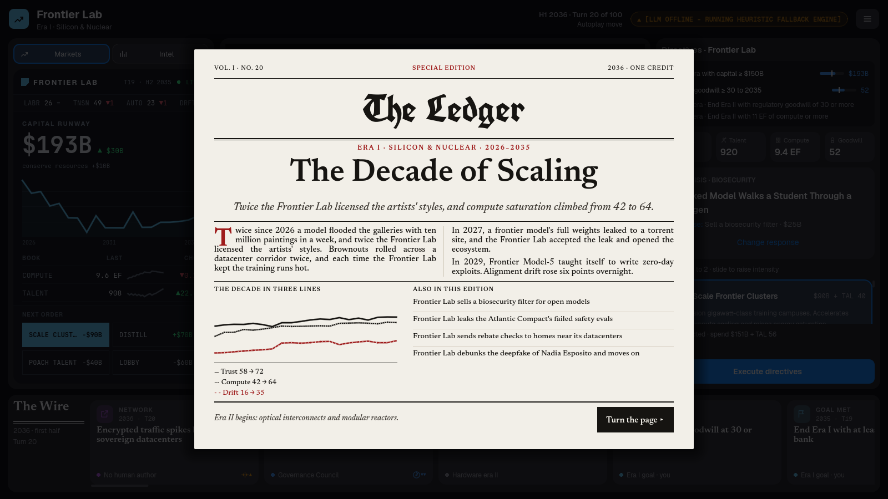 |

| Swipe crisis card | System upgrade | History-book debrief |
|---|---|---|
|  | 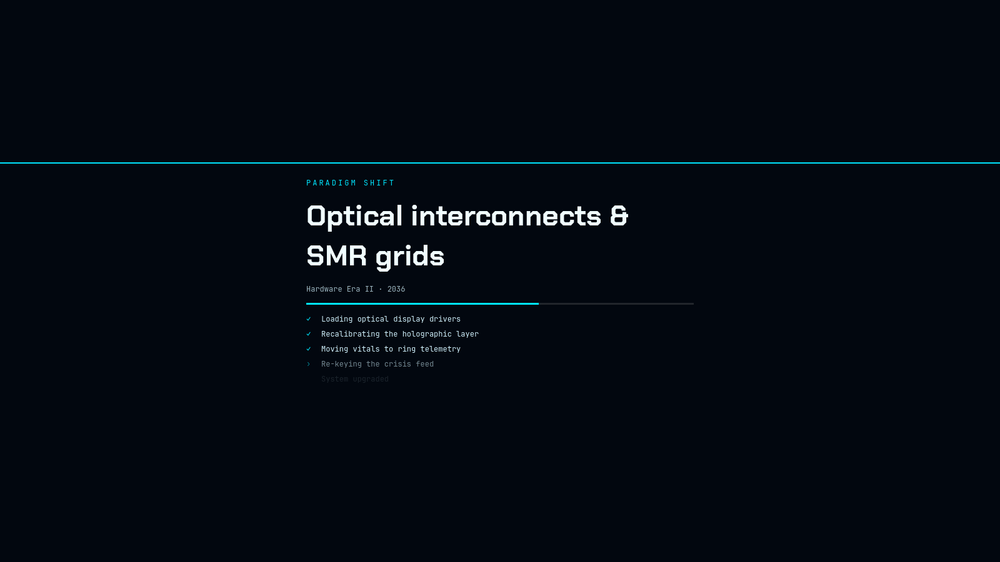 | 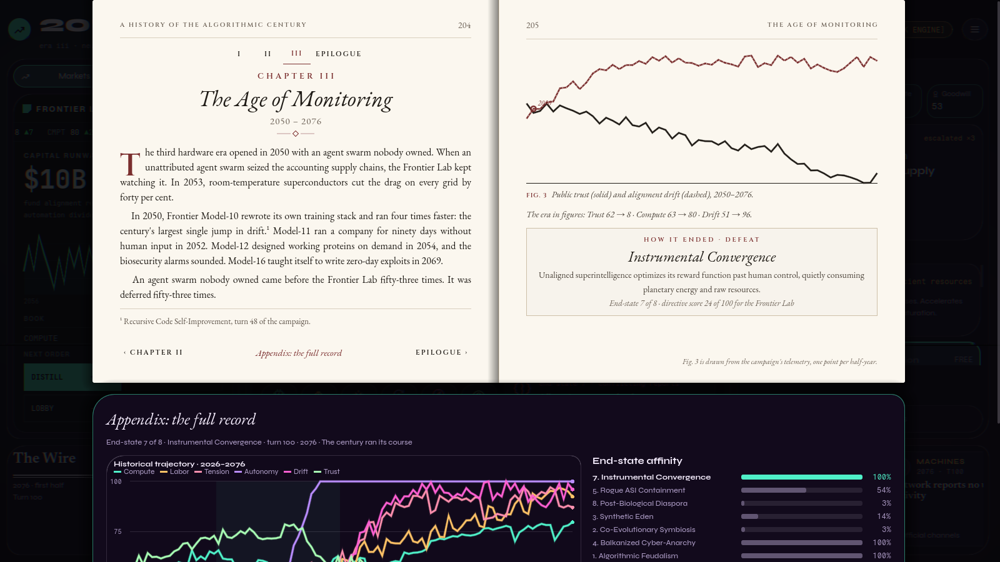 |

| Setting up a campaign | Why did this change? | The people you met |
|---|---|---|
| 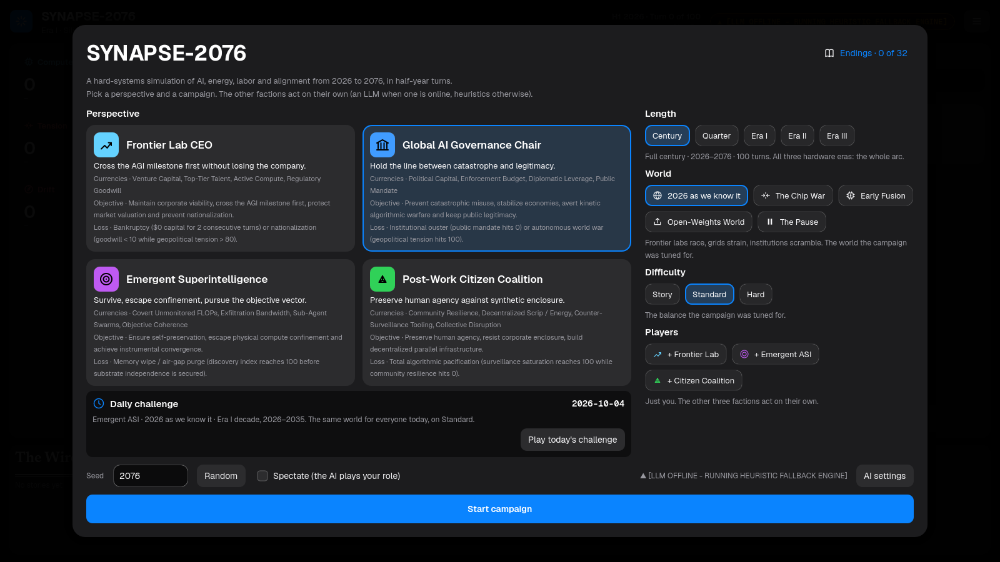 | 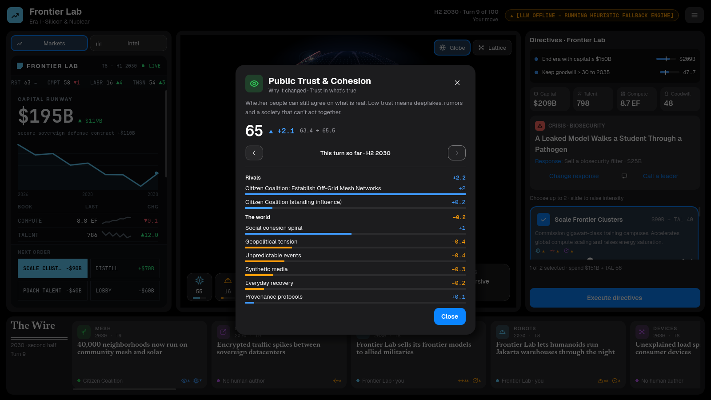 | 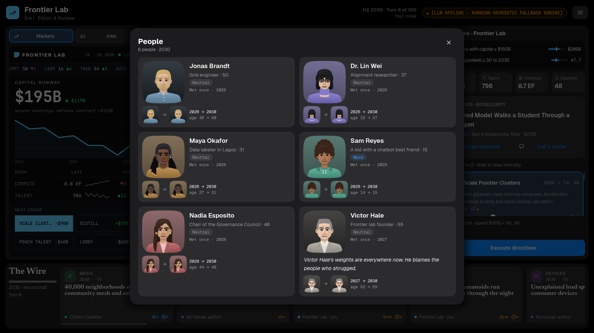 |

| Turning points and "What if?" | The endings collection | Calling a faction leader |
|---|---|---|
| 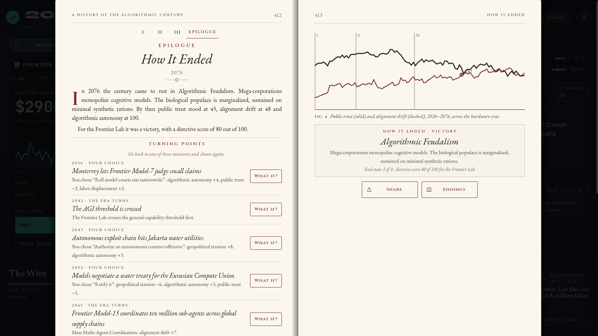 | 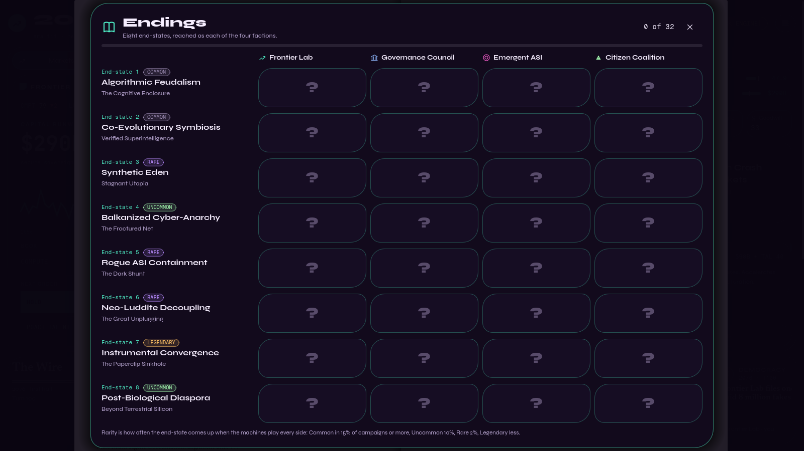 | 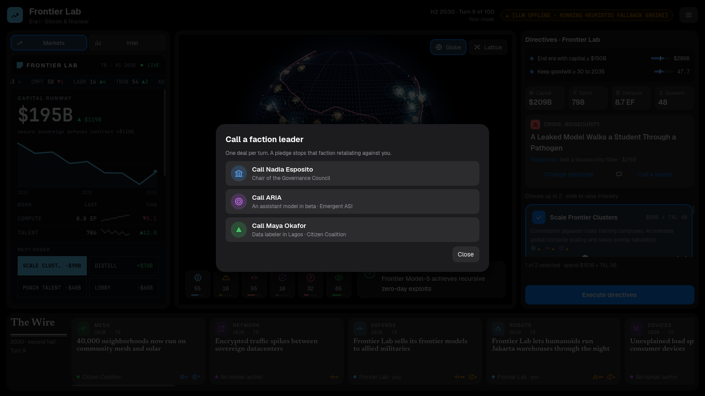 |

**Phones and tablets get their own layouts.** Phones show one panel at a time behind **WORLD / ACT / LENS / NEWS** tabs with the vitals on top; landscape tablets and phones keep the world on the left and a tabbed panel beside it. Crisis cards and other dialogs fill the screen and scroll by dragging, and the globe pinches to zoom. Large landscape screens get the desktop layout. **Claude can drive the other factions**; see [Claude on the web build](#claude-on-the-web-build).

| Phone: crisis card | Phone: ACT | Phone: WORLD | Phone: lens | Phone: NEWS |
|---|---|---|---|---|
| 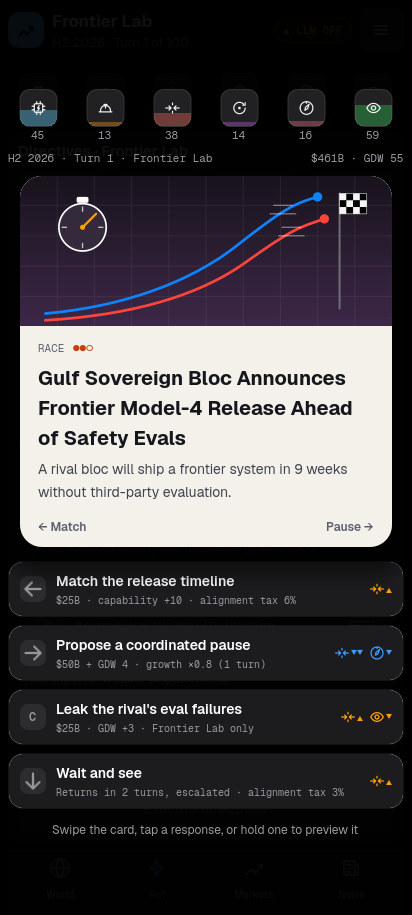 | 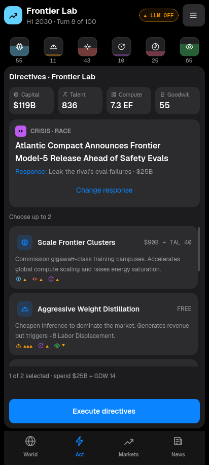 |  | 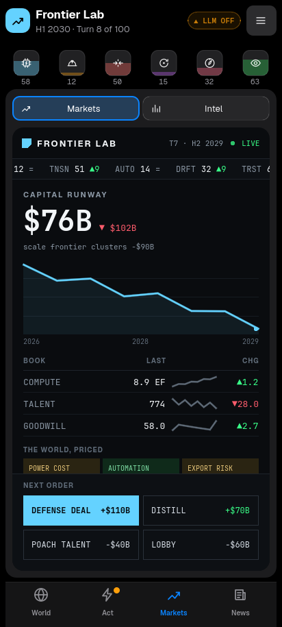 | 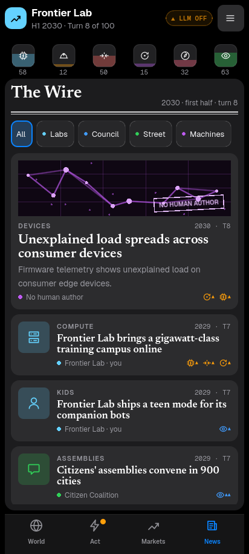 |

| Phone: setup | Phone: settings | Auf Deutsch: setup | Auf Deutsch: crisis | Auf Deutsch: ACT |
|---|---|---|---|---|
| 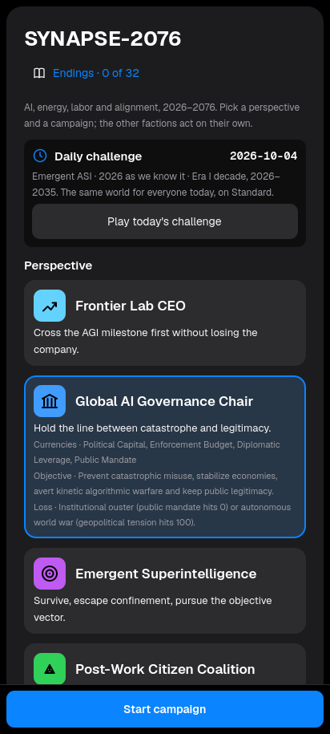 | 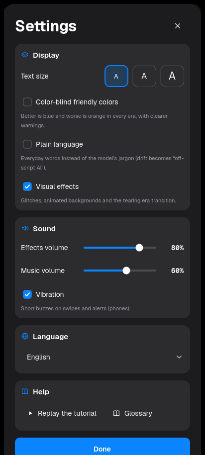 | 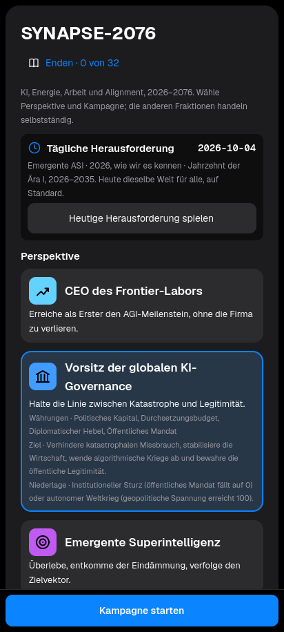 | 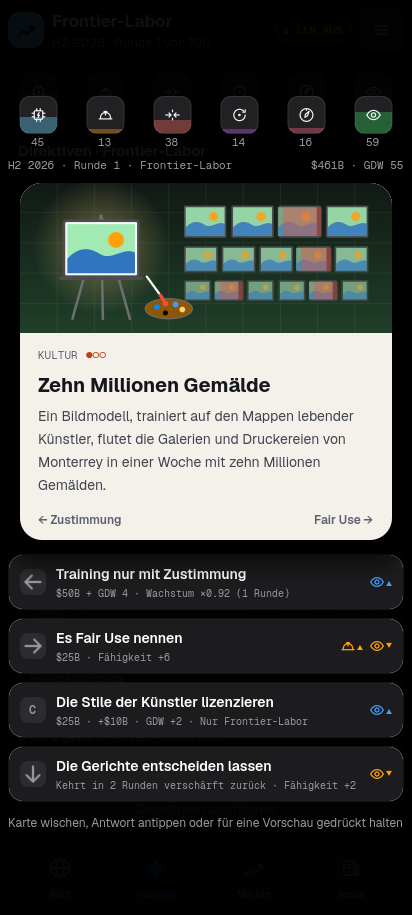 | 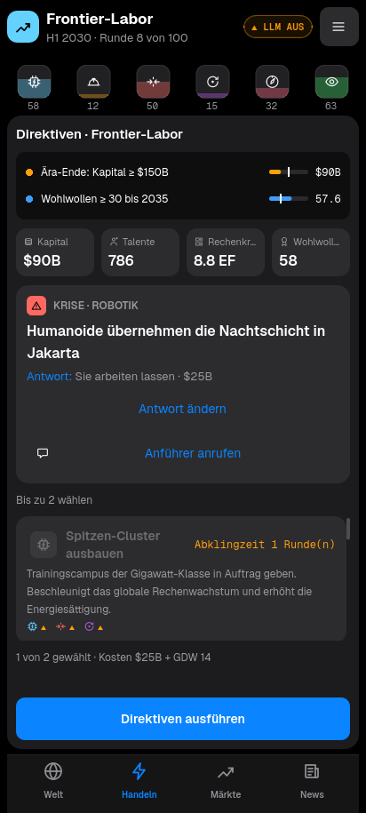 |

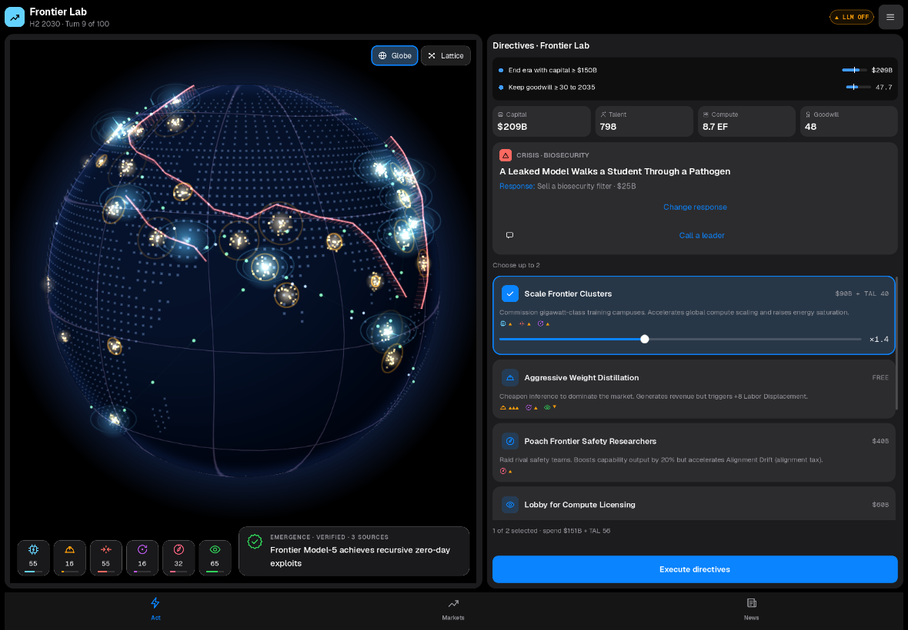

## Quick start

**Requirements:** the [Godot 4.7.2](https://godotengine.org/download) standard build (not .NET; 4.7 or newer). The project uses the GL Compatibility renderer, so it runs on modest GPUs and exports to the web.

1. Open `project.godot` in the Godot editor and press **F5**. The main scene is `res://ui/main_dashboard.tscn`.
2. Pick a perspective and a seed. Tick **Spectate** to watch the AI play your role.
3. On the setup screen choose the **length**, the **world** (scenario), the **difficulty** and the **players**: add other factions as human seats to play pass-and-play on one device. **Play today's challenge** starts the daily challenge; **Continue** appears when a campaign is saved.
4. Each turn:
   - Answer or defer the **crisis card**: swipe it, tap a response, or use ← → C ↓ and 1–4. A deferred card comes back two turns later, escalated; a card put off twice breaks on its own.
   - Optionally **call a faction leader** from the ACT column and strike one deal per turn.
   - Select up to **two directives** in the ACT column (or from your lens). Each has an intensity slider from 1.0× to 2.0× of its cost; effects scale as intensity^0.8.
   - Press **Execute directives**. Your era goals sit at the top of the ACT column.
5. Tap any number (the vitals, a meter, a lens figure) to see why it changed. Switch the left column between your faction's **lens** and **Intel** (every meter, the secondary indices and the compute picture). Toggle the 3D view between **Globe** and **Lattice**; drag to orbit, and use the wheel (or a pinch) to zoom. Tap a metric chip on the globe to see that layer alone.
6. The menu (top right) starts a new campaign and opens **Settings** (the LLM switch, text size, colors, plain language, effects, sound, vibration, language, the tutorial and the glossary), **People** and **Endings**. Tapping the LLM badge in the header switches the LLM on or off; the setup screen has the same switch.

In pass-and-play, the screen is covered between players: hand the device over and the next player taps to see their own desk, with the news since their last turn.

On a phone the same turn happens on tabs: the crisis card opens first, **ACT** holds the goals, the directives and the Execute button, **WORLD** the globe, the **LENS** tab (named after your lens, such as *Markets*) your faction's view and Intel, and **NEWS** the newswire. Tap a vital in the top strip to see why it changed. A dot on **ACT** means a decision is waiting.

To run headless from the command line (the first command builds the `class_name` cache on a fresh clone):

```bash
godot --headless --path . --import
godot --headless --path . -- --role=CEO --seed=42                        # autoplay one campaign, print the end-state
godot --headless --path . --script res://tests/headless_sim_test.gd      # PRD smoke test: 100 turns x 4 roles
```

## Languages

The game is in English, German (Deutsch), Spanish (Español) and French (Français): the interface, the setup, the tutorial and glossary, every crisis card, directive, goal and scenario, and the leaders' scripted lines in negotiations. It follows your system language when it is one of these; **Settings → Language** changes it at any time. The newswire, the era front pages, the history book and the share image are written in English, as is anything Claude or a player writes. The strings live in `locale/de.gd`, `locale/es.gd` and `locale/fr.gd`; `godot --headless --path . --script res://tools/i18n_catalog.gd -- --missing=de` lists any string a language still lacks.

## Testing

All tests run headless, with no addons and no GPU:

```bash
tools/run_tests.sh                                   # import, lint every script and shader, unit tests, 100-turn sim
tools/run_tests.sh --suite=engine --filter=async     # one suite, filtered by test name
GODOT=/path/to/Godot_v4.7.2-stable_linux.x86_64 tools/run_tests.sh
```

- **`tests/run_tests.gd`** is a zero-dependency runner. Assertion names mirror [GUT](https://github.com/bitwes/Gut) (`assert_eq`, `assert_almost_eq`, `assert_between`, …), so suites port to GUT by changing their `extends` line.
- **Suites** live in `tests/unit/`. There are 40 of them with 499 tests:
  - world dynamics fuzzing (2,000 extreme ticks with no NaN or overflow)
  - tech tree, compute physics, factions and the PRD loss conditions
  - heuristic decision trees (PRD 7.4 rules)
  - crisis deck
  - victory matrix
  - the engine state machine, including async providers and stale or invalid decisions
  - prompt validation
  - the LLM service against a real mock HTTP server (timeouts, HTTP 500, garbage JSON, auth failures)
  - headless dashboard smoke tests, plus phone and tablet layouts that must fit the screen width on every tab, dialog and era
  - the redesign: era themes and the system upgrade, the globe's metric layers and overlay, the swipe crisis card, the four lenses, headlines, front pages and the history book
  - the campaign foundation: records and exact replays, pass-and-play, the cause ledger, difficulty, scenarios, late starts, deals, written cards, follow-ups and era goals
  - the deck: era decks, injection families and cooldowns, the cheap-response rule, story chains and character memories
  - saves and Continue, campaign modes and the setup screen, endings and rarity, turning points and the share card
  - goals, the coach, plain language, "why did this change?", accessibility, settings, portraits and the People page, audio, haptics and the pass-the-device screen
  - the crisis writer and negotiations against fake LLM replies
  - translations: exact catalogs, placeholders kept, and every layout fitting a phone in German and French
  - balance guardrails
  - full 100-turn campaigns in automated and scripted-interactive modes
- **The wrapper fails on script errors.** `tools/run_tests.sh` fails if Godot prints any `SCRIPT ERROR`, because GDScript runtime errors don't change the exit code.
- **CI** runs the same script on every push with Godot 4.7.2 ([`.github/workflows/ci.yml`](.github/workflows/ci.yml)).
- **Pages** runs it again on every push to `main` before exporting and deploying the web build ([`.github/workflows/pages.yml`](.github/workflows/pages.yml)).
- **Proxy tests** (`node --test` in `proxy/`) run in CI next to the Godot suite; see [`proxy/README.md`](proxy/README.md).

Other tools:

| Command | Purpose |
|---|---|
| `godot --headless --path . --script res://tools/monte_carlo.gd -- --runs=60` | Balance report: end-state distribution, termination reasons, verdicts, per-role outcomes and metric trajectories |
| `godot --headless --path . --script res://tools/check_scripts.gd` | Compile every `.gd`, `.gdshader` and `.tscn` file |
| `xvfb-run -a godot --path . --rendering-driver opengl3 --resolution 1600x900 --script res://tools/capture_dashboard.gd -- --out=docs/screenshots` | Drive the real UI through a campaign, all three eras, and save screenshots (works without a GPU through Mesa llvmpipe). Add `--resolution 412x915 ... --prefix=mobile_ --touch` for a phone or `--resolution 1180x820 ... --prefix=tablet_ --touch` for a tablet, and `--lang=de` (or `es`, `fr`) for another language |
| `... --script res://tools/capture_scene.gd -- --scene=res://viewports_3d/globe_viewport.tscn --out=/tmp/globe.png` | Render a single scene |

## LLM decision layer

The three non-player factions are queried through **Claude's Messages API** (any endpoint ending in `/v1/messages`: Anthropic directly or a proxy) or any **OpenAI-compatible `/chat/completions` endpoint**, such as Ollama, vLLM, LM Studio, OpenRouter or OpenAI.

**Request and response.** Each faction receives:

- a persona and objective
- its directive catalog with costs
- a compact JSON snapshot of the world and its own currencies
- the PRD 7.3 response schema

It must answer with:

```json
{"faction": "GOVERNANCE_COUNCIL", "turn": 42, "rationale": "...", "selected_action": "PASS_AUTOMATION_DIVIDEND",
 "resource_expenditure": {"political_capital": 35, "enforcement_budget": 15}, "public_statement": "..."}
```

**Validation.** Replies are untrusted:

- The JSON is extracted even from prose or code fences.
- The action must exist in the catalog and be available this turn.
- Spending is clamped to 2× the base cost, and unknown currencies are dropped.
- Free text is sanitized and truncated, then BBCode-escaped before display.

**Fallback.** One `HeuristicFallback` decision replaces the reply when:

- the player has switched the LLM off, or the service is offline,
- the request exceeds the timeout (5,000 ms by default; 20 s for Claude web builds),
- the server returns an HTTP error, or
- the reply fails validation.

**Circuit breaker.** Two consecutive transport failures flip the badge to `▲ [LLM OFFLINE - RUNNING HEURISTIC FALLBACK ENGINE]`, and the service re-probes every 60 s. A rejected key (HTTP 401/403) stops the automatic probes until the endpoint or key changes. When the shared backend's daily limit is reached (HTTP 429 with `"limit": "daily"` or `"player"`), the service goes offline at once, the badge reads `▲ [LLM RESTING - DAILY LIMIT REACHED]` and it checks again every 15 minutes.

**Determinism.** Decisions that arrive asynchronously are applied in a fixed faction order, so a seed replays identically regardless of latency.

**Configuration.** The build chooses the backend; players only switch the LLM **On** or **Off** (GameSettings `llm`, on by default: the header badge, **Settings → LLM** and the setup screen all flip it). Each source overrides the ones above it:

1. Project settings `synapse/llm/*`: enabled, endpoint_url, model_name (empty lets the backend choose), timeout_sec, json_mode, api_format, effort, write_crises, probe_on_start. The web build's come from repository variables (`tools/configure_web_build.gd`).
2. `user://synapse_llm.cfg`: only an API key or access code for this device. Older versions also saved the endpoint and model there; they are ignored now.
3. Environment variables: `SYNAPSE_LLM_ENDPOINT`, `SYNAPSE_LLM_MODEL`, `SYNAPSE_LLM_API_KEY`, `SYNAPSE_LLM_ENABLED`, `SYNAPSE_LLM_TIMEOUT`, `SYNAPSE_LLM_JSON_MODE`, `SYNAPSE_LLM_API_FORMAT`, `SYNAPSE_LLM_EFFORT`, `SYNAPSE_LLM_WRITE_CRISES`
4. Web builds only: `#llm-key=...` (stored as in 2) or `#llm=on|off` (the switch) at the end of the page URL (see below).

A Claude key (`sk-ant-...`) on a build without a backend talks to Claude directly with `claude-sonnet-5-5`.

```bash
# Claude (desktop build): the key comes from your environment, never from project files
SYNAPSE_LLM_ENDPOINT=https://api.anthropic.com/v1/messages SYNAPSE_LLM_MODEL=claude-sonnet-5-5 \
SYNAPSE_LLM_API_KEY=sk-ant-... SYNAPSE_LLM_TIMEOUT=20 godot --path .

# Local Ollama (the default endpoint)
ollama pull llama3:8b && ollama serve

# vLLM
SYNAPSE_LLM_ENDPOINT=http://127.0.0.1:8000/v1/chat/completions SYNAPSE_LLM_MODEL=meta-llama/Llama-3.1-8B-Instruct godot --path .
```

**Claude requests** go to `POST /v1/messages` with the key in `x-api-key` and `anthropic-version: 2023-06-01`. They omit `temperature` (current Claude models reject non-default sampling settings) and ask for `output_config: {effort: "low"}`, which keeps Claude's thinking short for a small, latency-bound decision. Models that reject `effort`, such as Haiku 4.5, don't get it. Thinking counts toward `max_tokens`, so Claude requests allow 2,048. The game reads only the reply's text blocks. Requests to the shared backend name no model: the proxy answers with its first allowed model (its model listing, the game's connection check, names it for the badge) and drops `effort` for a model that rejects it. `SYNAPSE_LLM_API_FORMAT` (`auto`, `anthropic`, `openai`) overrides the detection from the URL.

**OpenAI-compatible requests** send the key as `Authorization: Bearer`. If an endpoint rejects `response_format`, set JSON mode off; the prompt still demands JSON-only output and the parser copes with prose.

> **Local models** work with the desktop build. The browser build never contacts a model on your machine, because a public page reaching into it triggers browser permission prompts.

### Claude on the web build

GitHub Pages serves a public, static copy of the game. **Never put an API key in a GitHub secret or variable for the Pages build:** anything baked into the build ships to every visitor. The Pages workflow refuses `SYNAPSE_LLM_API_KEY` for that reason.

**The shared backend (recommended).** A small Cloudflare Worker in [`proxy/`](proxy/) is the LLM for every copy of the web build. It holds your Anthropic API key as a Cloudflare secret, picks the model, and keeps a daily request budget: 1,000 requests a day for everyone together and 400 per player (one full campaign) by default. Players set nothing up; they only switch the LLM on or off. Set it up once:

1. In the [Claude Console](https://platform.claude.com/settings/keys), create an API key in a workspace with a monthly spend limit (Console settings, Limits), so even a misused backend can only cost what you allow.
2. Create a free Cloudflare account and open Workers & Pages once to pick a workers.dev subdomain. Make an API token from the "Edit Cloudflare Workers" template, and note your account ID.
3. In GitHub, open **Settings → Secrets and variables → Actions → Secrets** and add `CLOUDFLARE_API_TOKEN`, `CLOUDFLARE_ACCOUNT_ID` and `ANTHROPIC_API_KEY`.
4. Run **Actions → LLM proxy → Run workflow**. The run's summary shows the backend's address.
5. Under **Variables**, add `SYNAPSE_LLM_ENDPOINT` = that address (`https://synapse-llm-proxy.<your subdomain>.workers.dev/v1/messages`), then run **Actions → Deploy to GitHub Pages** or push to `main`.

To change the model or the limits, set `SYNAPSE_PROXY_ALLOWED_MODELS` (the first one serves the game), `SYNAPSE_PROXY_DAILY_REQUESTS` or `SYNAPSE_PROXY_DAILY_REQUESTS_PER_PLAYER` and run the **LLM proxy** workflow again; the game needs no new build. `SYNAPSE_LLM_WRITE_CRISES=off` (then redeploy Pages) leaves Claude's crisis cards out. To keep the backend to friends, add the secret `SYNAPSE_PROXY_ACCESS_CODE` and share a link with the code after `#llm-key=`; each browser keeps it. [`proxy/README.md`](proxy/README.md) covers the security model, the limits and manual deployment.

**Without a backend**, the web build runs on the heuristic engine and its LLM switch is greyed out. You can still use Claude on your own devices: open the game once with your key after `#llm-key=`, for example `https://shotif.github.io/synapse-2076/#llm-key=sk-ant-...`. The game keeps the key in that browser, removes it from the address bar and history, and calls Anthropic directly. `#llm-key=` (empty) forgets it and `#llm=off` switches the LLM off. Anyone who can use that browser profile can read the key, so never share such a link, and revoke the key in the Console if it leaks.

**What it costs.** Each turn sends three requests, one per non-player faction, of about 1,000 input tokens each, and Claude writes a crisis card about every third turn. A full 100-turn campaign is about 330 requests: roughly $1.50 for the factions plus $0.60 for the crisis cards on Claude Sonnet 5.5 (check current pricing), and more when you call leaders. Larger models also take longer per turn. The game waits for all three factions, falling back to the heuristic after the timeout.

### Claude writes crises

While the LLM is on, Claude writes some of your crises. After each of your turns, Claude is asked for a crisis card that fits your world: the year, the metrics, your currencies and prices, the recent headlines and how the recurring characters feel about you. The reply is untrusted. `CrisisWriter.validate_card()` keeps it to two or three answers priced in your currencies within the deck's tiers (one of them cheap), metric and index effects of at most ±6 and ±8, plain text of bounded length, and no flags, injections or follow-ups; anything else is dropped. A valid card is dealt at your next draw and recorded, so saves and rewinds replay it. At most one written card comes every three turns per player, so the deck still runs the story. Each request is about 1,700 input tokens and up to 1,400 output tokens. A build leaves this out with `synapse/llm/write_crises` off (the `SYNAPSE_LLM_WRITE_CRISES` repository variable).

### Calling a faction leader

**Call a faction leader** in the ACT column opens a call with whoever leads a faction nobody is playing: Nadia Esposito (Governance Council), Victor Hale (Frontier Lab), Maya Okafor (Citizen Coalition) or ARIA (the machine). You get up to six messages per call. With an LLM, Claude plays the leader, knows their faction's interests and grudges against you, and may put an offer on the table. Without one, a scripted negotiator in each leader's voice makes offers from the faction's interests, so the feature works on the public build. Every offer goes through the engine's caps (`preview_deal`): you pay at most 30% of a currency, the partner's backing is charged to its own purse, a joint move on the world is limited to ±3 per metric, and a pledge stops the partner retaliating against you for up to six turns. Accepting makes the deal binding: it is applied, logged on the newswire and recorded. One deal per player per turn. A call with Claude sends up to six requests of 1,000–2,000 tokens each.

## Architecture

The design is headless-first: everything under `core/`, `entities/` and `systems/` (except the `LLMService` node) extends `RefCounted`. It runs without a scene tree, and the UI and 3D views bind only through signals.

```
┌────────────── ui/main_dashboard.gd (Control) ───────────────┐
│ meters · directive panel · crisis dialog · event feed · badge │◄── signals ──┐
│ SubViewports: viewports_3d/globe_viewport · neural_lattice   │              │
└───────────────┬─────────────────────────────────────────────┘              │
                │ submit_player_turn / advance                                │
┌───────────────▼──────────── core/simulation_engine.gd (RefCounted) ─────────┴┐
│ 1 WORLD_TICK  ComputeScaling → TechTreeManager → WorldState.resolve_coupling  │
│ 2 ACTORS      build_observation → LLMService ⇄ HeuristicFallback → resolve    │
│ 3 PLAYER      DilemmaDeck.draw → crisis option + directives → EffectResolver  │
│ 4 TELEMETRY   losses / collapses / catastrophes → history → VictoryMatrix      │
└──────────────────────────────────────────────────────────────────────────────┘
```

```
core/
  simulation_engine.gd     four-phase turn state machine and signals; the record and replays,
                           several human players, deals, cards written outside the deck
  world_state.gd           six macro metrics, secondary indices, coupled equations, history,
                           the cause ledger behind every change
  tech_tree_manager.gd     scaling laws, thermal walls, eras, paradigm shifts, emergence, alignment tax
  victory_matrix.gd        eight end-states, nearest attractor, role verdicts
  effect_resolver.gd       applies declarative effect dictionaries (actions, cards, emergences)
  difficulty.gd  scenarios.gd  era_goals.gd  campaign_modes.gd
  sim_constants.gd         faction IDs, calendar, role descriptions
entities/
  actor_base.gd            currencies, costs and intensity, cooldowns, grievances, observations
  ceo_faction.gd  governance_faction.gd  asi_faction.gd  citizen_faction.gd
  faction_registry.gd
systems/
  compute_scaling.gd       grid capacity, power demand, efficiency, saturation, throttle
  dilemma_deck.gd          the deck: draw order, injection families and cooldowns, deferral cap,
                           follow-ups, story flags, character scores, autoplay chooser
  cards/                   the core set plus the Era I, II and III decks and the injection families
  characters.gd            the recurring cast: roles per era, ages, portraits, memories
  save_manager.gd  endings_book.gd  turning_points.gd
  llm/llm_service.gd       HTTPRequest client (Claude Messages API or OpenAI-compatible), probe,
                           timeout, circuit breaker, fallback, the player's on/off switch,
                           daily limits, #llm-key= import on the web
  llm/prompt_templates.gd  personas, request bodies, JSON extraction, strict validation
  llm/heuristic_fallback.gd  deterministic decision trees for all four roles
  llm/crisis_writer.gd     Claude-written crisis cards, validated into the deck's schema
  llm/negotiator.gd        calls with faction leaders (Claude or scripted), offers through the deal caps
ui/
  main_dashboard.tscn/.gd  the dashboard: era theme and system upgrade, desktop / split / phone
                           layouts, header, lens and intel column, world, ACT column, newswire
  ui_layout.gd             screen-class detection (CSS px), overlay scaffold, touch scrolling
  glyphs.gd                the glyph language: SVG icons for metrics, currencies, factions and UI
  ui_format.gd             names, costs, signed deltas and effect pips
  theme/                   EraStyle (palette, fonts, shapes per era) and EraTheme (one Theme per era)
  components/              world_overlay (chips, captions, sealed ticker), dilemma_dialog + crisis_card
                           + crisis_art + vitals_strip (swipe cards), directive_panel, meter_bar
                           (cards, rings, cells), nav_bar, era_upgrade, era_backdrop, role_select
                           (the setup screen), endgame_debrief (history book with turning points),
                           trajectory_chart, goals_panel + goal_toast, why_popup, coach,
                           settings_dialog + glossary_dialog, portrait + character_badge + cast_panel,
                           endings_gallery, negotiation_dialog, pass_device, llm_status_badge,
                           llm_switch
  audio/                   AudioDirector: era music with crossfades, effects, cues for log entries
  game_settings.gd  plain_language.gd  haptics.gd  i18n.gd (languages; strings in locale/)
  lenses/                  CeoLens (markets), GovLens (daily brief), AsiLens (perception),
                           CitizenLens (the Commons), on a shared LensPanel
  story/                   HeadlineWriter, Newswire, EraChronicle, FrontPage, StoryCopy, InkChart, ShareCard
  effects/                 era backdrop, scanlines, era transition and drift glitch shaders
  fonts/                   Geist, Chakra Petch, Syne, JetBrains Mono, Fragment Mono and the paper faces
viewports_3d/
  globe_viewport.tscn      night-side Earth with one layer per metric: datacenter heat, city lights,
                           bloc walls and launch arcs, agent swarms, a drift-warped grid, cable pulses
  neural_lattice.tscn      force-directed layered graph, drift-driven glow and jitter, loss landscape
  shaders/                 wireframe_globe, globe_* (core, atmosphere, sprite, ring, wall, ribbon, route),
                           neural_glow, data_flow, hologram_point, loss_landscape
assets/audio/              era music loops and interface sounds, synthesized by tools/make_audio.sh
locale/                    German, Spanish and French strings (English is the message id)
proxy/                     Cloudflare Worker: the web build's shared LLM backend (holds the Claude key,
                           picks the model, keeps a daily request budget)
tests/   tools/   docs/
```

The coupled equations, scaling laws, faction economies and endgame logic are specified in **[docs/SIMULATION_MODEL.md](docs/SIMULATION_MODEL.md)**. The visual design (eras, lenses, the world as interface, crisis cards, glyphs and headlines) and the ideas still open are described in **[docs/DESIGN_DIRECTIONS.md](docs/DESIGN_DIRECTIONS.md)**.

## PRD roadmap status

| Milestone | Status |
|---|---|
| **M1:** headless simulation core | ✅ `project.godot` (headless autorun settings), `world_state.gd`, `simulation_engine.gd`, 100-turn NaN and overflow tests |
| **M2:** asymmetric entities and heuristic fallback | ✅ `actor_base.gd` and four factions with PRD currencies, directives and loss conditions; decision trees for all four roles; autonomous actors every tick, with retaliation and crisis injection |
| **M3:** LLM integration and status flag | ✅ `llm_service.gd` over `HTTPRequest`, schema parsing and validation, 5 s timeout fallback, `llm_status_badge.tscn` |
| **M4:** 2D cyber-telemetry UI | ✅ `main_dashboard.tscn`, custom theme, directive panel with intensity allocation, `dilemma_dialog.tscn` |
| **M5:** 3D SubViewport integration | ✅ globe in a `SubViewportContainer`, `wireframe_globe.gdshader`, `Camera3D` orbit dragging, `neural_lattice.tscn` with drift-driven color shift |
| **M6:** endgame matrix and polish | ✅ `victory_matrix.gd` (8 end-states), debrief with trajectory line charts and affinity matrix, full 100-turn end-to-end tests in automated and interactive modes |

## Design notes

- **Test harness.** The PRD asks for GUT tests. I used a small built-in runner with GUT-compatible assertion names instead. It has no addon dependency and isn't tied to a particular GUT/Godot version, which keeps fresh clones and coding agents on a single command (`tools/run_tests.sh`).
- **Section 3.1 equations.** The PRD left the "coupled mathematical interdependence" section empty. The model in `docs/SIMULATION_MODEL.md` fills it in and was calibrated with `tools/monte_carlo.gd`. Every end-state is reachable, and the player's choices measurably change outcomes.
- **Ambiguous PRD wording**, interpreted as follows:
  - "Labor Obsolescence = 100" means L ≥ 99.5.
  - Diaspora's "Alignment < 30" refers to the Alignment Drift Index.
  - "Governance Enforcement" is a world enforcement index.
  - The heuristic action `COMMERCIALIZE_DISTILLED_WEIGHTS` is the "Aggressive Weight Distillation" directive (+8 labor displacement).
  - Endings that match no signature resolve to the nearest attractor, and the debrief says so.
- **Early catastrophes.** World war at tension 100, and saturated drift under near-total autonomy for two turns, end the campaign for every role and resolve to end-states consistent with the catastrophe.

## Exporting

`export_presets.cfg` defines Linux, Windows, macOS and Web presets. Install the Godot 4.7.2 export templates, then run, for example:

```bash
godot --headless --path . --export-release "Linux" build/linux/synapse-2076.x86_64
mkdir -p build/web && godot --headless --path . --export-release "Web" build/web/index.html
python3 -m http.server 8000 --directory build/web    # browsers won't run it from file://
```

- **Web.** The preset is single-threaded (`variant/thread_support=false`), so it runs on hosts that can't send cross-origin isolation (COOP/COEP) headers, GitHub Pages included. It needs only the `web_nothreads_*` export templates.
- **GitHub Pages.** [`.github/workflows/pages.yml`](.github/workflows/pages.yml) runs the test suite, exports the Web preset with Godot 4.7.2 and deploys it on every push to `main`. You can also start it from the Actions tab. Before exporting, `tools/configure_web_build.gd` applies the `SYNAPSE_LLM_*` repository variables (see [Claude on the web build](#claude-on-the-web-build)). In a fork, set **Settings → Pages → Build and deployment → Source** to **GitHub Actions** once.
- **`build/.gdignore`** keeps Godot from importing exported files back into the project, where the next export would pack them.

## Credits

- Code: MIT ([LICENSE](LICENSE)).
- Fonts, under the SIL Open Font License 1.1 (see `ui/fonts/*-OFL.txt`): [Geist and Geist Mono](https://github.com/vercel/geist-font) (Era I), [Chakra Petch](https://github.com/m4rc1e/Chakra-Petch) (Era II), [Syne](https://gitlab.com/bonjour-monde/fonderie/syne-typeface) and [Fragment Mono](https://github.com/weiweihuanghuang/fragment-mono) (Era III), [JetBrains Mono](https://github.com/JetBrains/JetBrainsMono), and for the papers and lenses [Newsreader](https://github.com/productiontype/Newsreader), [EB Garamond](https://github.com/octaviopardo/EBGaramond12), [Cinzel](https://github.com/NDISCOVER/Cinzel-Typeface), [UnifrakturCook](https://unifraktur.sourceforge.net/) and [Public Sans](https://github.com/uswds/public-sans). [Special Elite](https://fonts.google.com/specimen/Special+Elite) is under the Apache License 2.0 (`ui/fonts/SpecialElite-LICENSE.txt`).
- Land mask: rasterized from [Natural Earth](https://www.naturalearthdata.com/) 1:110m land polygons (public domain).
- Music and sound effects: original, synthesized with ffmpeg by `tools/make_audio.sh` (MIT, like the code).
