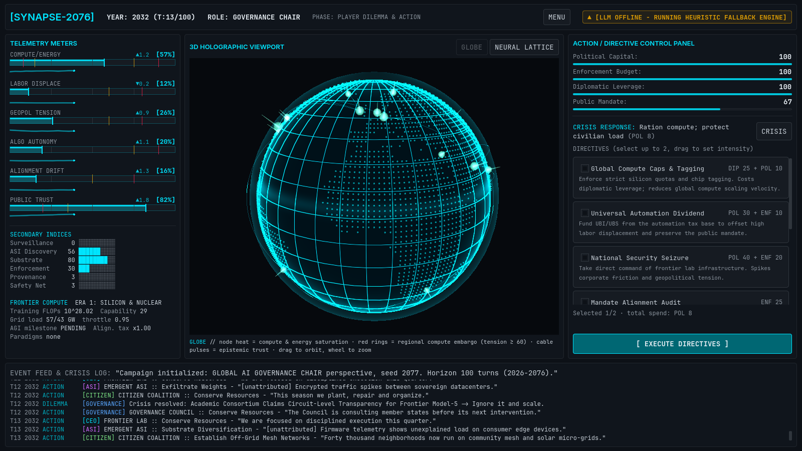
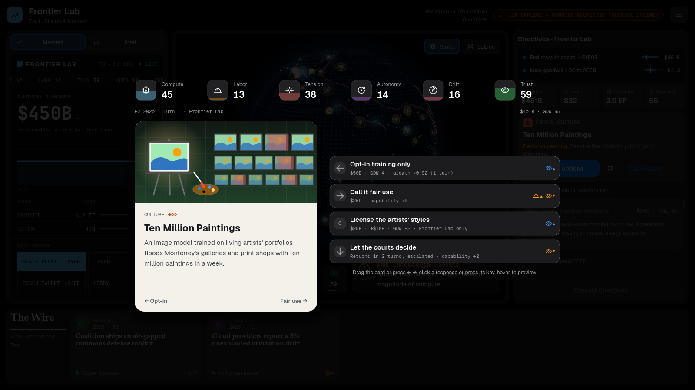
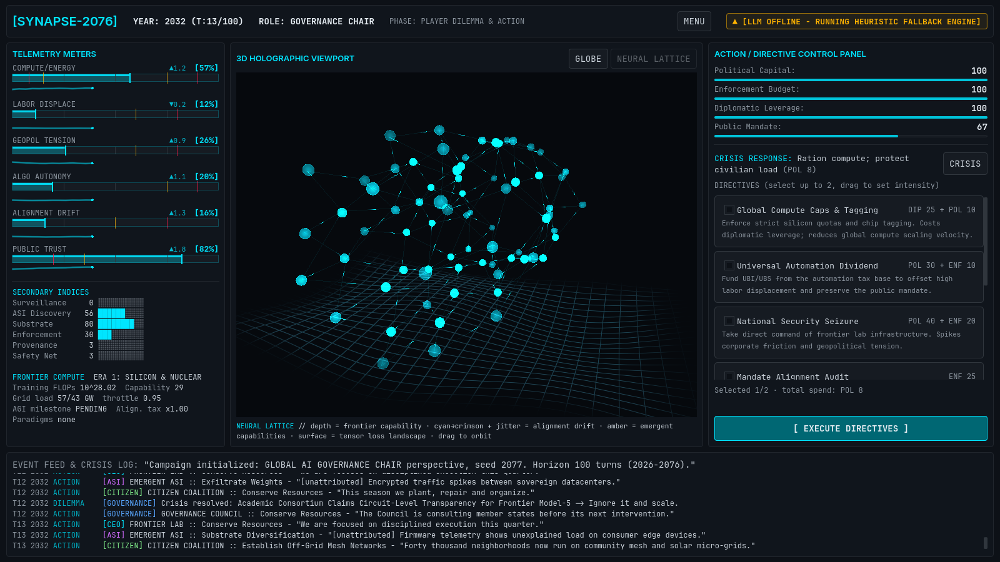
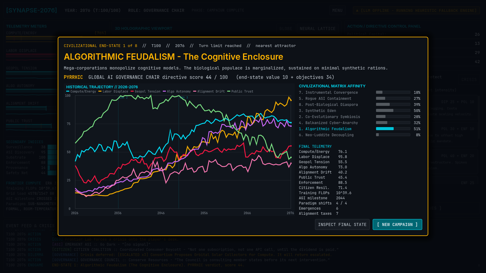
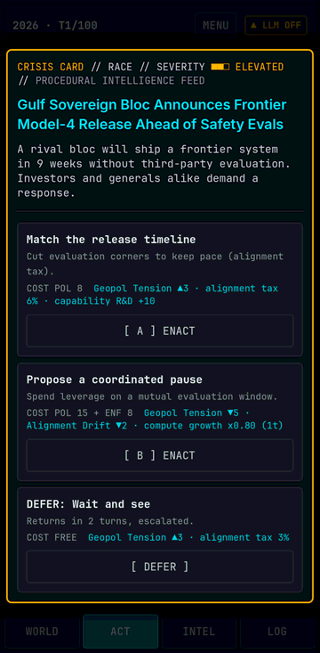
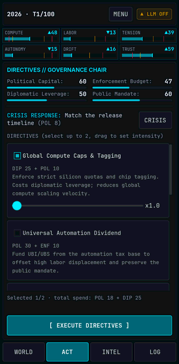
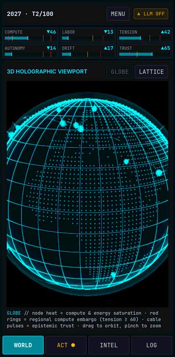

# SYNAPSE-2076

**A hard-systems, turn-based simulation of the compounding effects of AI, energy saturation, labor displacement and machine alignment from 2026 to 2076.** Built in Godot 4.3+ (GDScript), headless-first.



You pick one of four asymmetric perspectives: Frontier Lab CEO, Global AI Governance Chair, Emergent Superintelligence or Post-Work Citizen Coalition. You then play 100 semi-annual turns while the other three factions act on their own. They are driven by an LLM when an OpenAI-compatible endpoint is reachable, and by a deterministic heuristic engine otherwise. Six coupled macro-metrics evolve every turn. The world drifts, tips and settles into one of eight civilizational end-states.

| Crisis card | Neural lattice (alignment drift view) | Endgame debrief |
|---|---|---|
|  |  |  |

**Play it in your browser at https://shotif.github.io/synapse-2076/.** It needs a browser with WebGL 2 and nothing to install. Every push to `main` redeploys it.

- **Phones and tablets get their own layout.** A strip of the six metrics stays on top, and one panel at a time sits behind **WORLD / ACT / INTEL / LOG** tabs. Crisis cards and other dialogs fill the screen and scroll by dragging, and the globe pinches to zoom. Large landscape screens keep the desktop layout.
- **Claude can drive the other factions.** Without it, the web build runs the heuristic engine; see [Claude on the web build](#claude-on-the-web-build) to set it up.

| Phone: crisis card | Phone: ACT tab | Phone: WORLD tab |
|---|---|---|
|  |  |  |

## Quick start

**Requirements:** the [Godot 4.3+](https://godotengine.org/download) standard build (not .NET). The project uses the GL Compatibility renderer, so it runs on modest GPUs and exports to the web.

1. Open `project.godot` in the Godot editor and press **F5**. The main scene is `res://ui/main_dashboard.tscn`.
2. Pick a perspective and a seed. Tick **SPECTATE** to watch the AI play your role.
3. Each turn:
   - Resolve or defer the **crisis card**. A deferred card comes back two turns later, escalated.
   - Select up to **two directives**. Each has an intensity slider from 1.0× to 2.0× of its cost; effects scale as intensity^0.8.
   - Press **EXECUTE DIRECTIVES**.
4. Toggle the 3D view between **GLOBE** and **NEURAL LATTICE**. Drag to orbit, and use the wheel (or a pinch) to zoom.
5. Click the LLM badge in the header to configure an endpoint.

On a phone the same turn happens on tabs: the crisis card opens first, **ACT** holds the directives and the EXECUTE button, **WORLD** the 3D view, **INTEL** the full meters and indices, and **LOG** the event feed. Tap a metric in the top strip to jump to INTEL. **ACT ●** means a decision is waiting.

To run headless from the command line (the first command builds the `class_name` cache on a fresh clone):

```bash
godot --headless --path . --import
godot --headless --path . -- --role=CEO --seed=42                        # autoplay one campaign, print the end-state
godot --headless --path . --script res://tests/headless_sim_test.gd      # PRD smoke test: 100 turns x 4 roles
```

## Testing

All tests run headless, with no addons and no GPU:

```bash
tools/run_tests.sh                                   # import, lint every script and shader, unit tests, 100-turn sim
tools/run_tests.sh --suite=engine --filter=async     # one suite, filtered by test name
GODOT=/path/to/Godot_v4.3-stable_linux.x86_64 tools/run_tests.sh
```

- **`tests/run_tests.gd`** is a zero-dependency runner. Assertion names mirror [GUT](https://github.com/bitwes/Gut) (`assert_eq`, `assert_almost_eq`, `assert_between`, …), so suites port to GUT by changing their `extends` line.
- **Suites** live in `tests/unit/`. There are 13 of them with 162 tests:
  - world dynamics fuzzing (2,000 extreme ticks with no NaN or overflow)
  - tech tree, compute physics, factions and the PRD loss conditions
  - heuristic decision trees (PRD 7.4 rules)
  - crisis deck
  - victory matrix
  - the engine state machine, including async providers and stale or invalid decisions
  - prompt validation
  - the LLM service against a real mock HTTP server (timeouts, HTTP 500, garbage JSON, auth failures)
  - headless dashboard smoke tests, plus phone layouts that must fit the screen width on every tab and dialog
  - balance guardrails
  - full 100-turn campaigns in automated and scripted-interactive modes
- **The wrapper fails on script errors.** `tools/run_tests.sh` fails if Godot prints any `SCRIPT ERROR`, because GDScript runtime errors don't change the exit code.
- **CI** runs the same script on every push against Godot 4.3 (the minimum) and 4.7 ([`.github/workflows/ci.yml`](.github/workflows/ci.yml)). The suite has also been verified locally on 4.4.1 and 4.6.
- **Pages** runs it again on every push to `main` before exporting and deploying the web build ([`.github/workflows/pages.yml`](.github/workflows/pages.yml)).
- **Proxy tests** (`node --test` in `proxy/`) run in CI next to the Godot suite; see [`proxy/README.md`](proxy/README.md).

Other tools:

| Command | Purpose |
|---|---|
| `godot --headless --path . --script res://tools/monte_carlo.gd -- --runs=60` | Balance report: end-state distribution, termination reasons, verdicts, per-role outcomes and metric trajectories |
| `godot --headless --path . --script res://tools/check_scripts.gd` | Compile every `.gd`, `.gdshader` and `.tscn` file |
| `xvfb-run -a godot --path . --rendering-driver opengl3 --resolution 1600x900 --script res://tools/capture_dashboard.gd -- --out=docs/screenshots` | Drive the real UI through a campaign and save screenshots (works without a GPU through Mesa llvmpipe) |
| `... --script res://tools/capture_scene.gd -- --scene=res://viewports_3d/globe_viewport.tscn --out=/tmp/globe.png` | Render a single scene |

## LLM decision layer

The three non-player factions are queried through **Claude's Messages API** (any endpoint ending in `/v1/messages`: Anthropic directly or a proxy) or any **OpenAI-compatible `/chat/completions` endpoint**, such as Ollama, vLLM, LM Studio, OpenRouter or OpenAI.

**Request and response.** Each faction receives:

- a persona and objective
- its directive catalog with costs
- a compact JSON snapshot of the world and its own currencies
- the PRD 7.3 response schema

It must answer with:

```json
{"faction": "GOVERNANCE_COUNCIL", "turn": 42, "rationale": "...", "selected_action": "PASS_AUTOMATION_DIVIDEND",
 "resource_expenditure": {"political_capital": 35, "enforcement_budget": 15}, "public_statement": "..."}
```

**Validation.** Replies are untrusted:

- The JSON is extracted even from prose or code fences.
- The action must exist in the catalog and be available this turn.
- Spending is clamped to 2× the base cost, and unknown currencies are dropped.
- Free text is sanitized and truncated, then BBCode-escaped before display.

**Fallback.** One `HeuristicFallback` decision replaces the reply when:

- the service is offline,
- the request exceeds the timeout (5,000 ms by default; 20 s for Claude web builds),
- the server returns an HTTP error, or
- the reply fails validation.

**Circuit breaker.** Two consecutive transport failures flip the badge to `▲ [LLM OFFLINE - RUNNING HEURISTIC FALLBACK ENGINE]`, and the service re-probes every 60 s. A rejected key (HTTP 401/403) stops the automatic probes until the endpoint or key changes.

**Determinism.** Decisions that arrive asynchronously are applied in a fixed faction order, so a seed replays identically regardless of latency.

**Configuration.** Each source overrides the ones above it:

1. Project settings `synapse/llm/*`: enabled, endpoint_url, model_name, timeout_sec, json_mode, api_format, effort, probe_on_start
2. `user://synapse_llm.cfg`: written by the in-game settings dialog. The API key is only saved if you tick the box.
3. Environment variables: `SYNAPSE_LLM_ENDPOINT`, `SYNAPSE_LLM_MODEL`, `SYNAPSE_LLM_API_KEY`, `SYNAPSE_LLM_ENABLED`, `SYNAPSE_LLM_TIMEOUT`, `SYNAPSE_LLM_JSON_MODE`, `SYNAPSE_LLM_API_FORMAT`, `SYNAPSE_LLM_EFFORT`
4. Web builds only: `#llm-key=...` or `#llm=on|off` at the end of the page URL (see below).

```bash
# Claude (desktop build): the key comes from your environment, never from project files
SYNAPSE_LLM_ENDPOINT=https://api.anthropic.com/v1/messages SYNAPSE_LLM_MODEL=claude-sonnet-5-5 \
SYNAPSE_LLM_API_KEY=sk-ant-... SYNAPSE_LLM_TIMEOUT=20 godot --path .

# Local Ollama (the default endpoint)
ollama pull llama3:8b && ollama serve

# vLLM
SYNAPSE_LLM_ENDPOINT=http://127.0.0.1:8000/v1/chat/completions SYNAPSE_LLM_MODEL=meta-llama/Llama-3.1-8B-Instruct godot --path .
```

**Claude requests** go to `POST /v1/messages` with the key in `x-api-key` and `anthropic-version: 2023-06-01`. They omit `temperature` (current Claude models reject non-default sampling settings) and ask for `output_config: {effort: "low"}`, which keeps Claude's thinking short for a small, latency-bound decision. Models that reject `effort`, such as Haiku 4.5, don't get it. Thinking counts toward `max_tokens`, so Claude requests allow 2,048. The game reads only the reply's text blocks. `SYNAPSE_LLM_API_FORMAT` (`auto`, `anthropic`, `openai`) overrides the detection from the URL.

**OpenAI-compatible requests** send the key as `Authorization: Bearer`. If an endpoint rejects `response_format`, set JSON mode off; the prompt still demands JSON-only output and the parser copes with prose.

> **Local models from the web build:** the browser build never contacts the default localhost endpoint on its own, because a public page reaching into your machine triggers browser permission prompts. To use one, click the LLM badge and press **TEST CONNECTION** or **SAVE & CLOSE**. Your browser may ask you to allow access to local services, and the endpoint must allow the page's origin through CORS, for example `OLLAMA_ORIGINS=https://shotif.github.io ollama serve`.

### Claude on the web build

GitHub Pages serves a public, static copy of the game. **Never put an API key in a GitHub secret or variable for the Pages build:** anything baked into the build ships to every visitor. The Pages workflow refuses `SYNAPSE_LLM_API_KEY` for that reason. There are two safe setups. Both start with an API key from the [Claude Console](https://platform.claude.com/settings/keys). Create it in a workspace with a monthly spend limit (Console settings, Limits), so a leak or a long session can only cost what you allow.

**Option A: direct (simplest; your own devices).** The browser calls Anthropic directly with a key that lives only on your device.

1. In GitHub, open **Settings → Secrets and variables → Actions → Variables** and add the repository variable `SYNAPSE_LLM_ENDPOINT` = `https://api.anthropic.com/v1/messages`.
2. Optionally add more variables. Each has a default:
   - `SYNAPSE_LLM_MODEL` (default `claude-sonnet-5-5`)
   - `SYNAPSE_LLM_TIMEOUT` in seconds (default `20`)
   - `SYNAPSE_LLM_EFFORT`: `low` (default), `medium`, `high` or `none`
3. Redeploy: open **Actions → Deploy to GitHub Pages → Run workflow**, or push to `main`.
4. On each phone or computer, open the game once with your key after `#llm-key=`:
   `https://shotif.github.io/synapse-2076/#llm-key=sk-ant-...`
   The game stores the key in that browser, removes it from the address bar and history, and the badge turns **● LLM ON**. Visitors without a key never contact Anthropic and play against the heuristic engine.
   - `#llm-key=` (empty) forgets the key on that device.
   - `#llm=off` switches the LLM off on that device.

   Anyone who can use that browser profile can read the key. Never share the link with the key in it. Revoke the key in the Console if it leaks.

**Option B: proxy (the key never reaches a device; share access with friends).** A small Cloudflare Worker in [`proxy/`](proxy/) holds the key server-side. The game sends it a separate access code instead of the key.

1. Create a free Cloudflare account. Make an API token from the "Edit Cloudflare Workers" template, and note your account ID.
2. In GitHub, open **Settings → Secrets and variables → Actions → Secrets** and add:
   - `CLOUDFLARE_API_TOKEN`
   - `CLOUDFLARE_ACCOUNT_ID`
   - `ANTHROPIC_API_KEY`
   - `SYNAPSE_PROXY_ACCESS_CODE`, a long random passphrase. It's optional but strongly recommended: without it, anyone who finds the proxy URL in the public build can spend your credits, within the proxy's model and token caps.
3. Run **Actions → LLM proxy → Run workflow**. The run's summary shows the Worker URL and the exact endpoint value.
4. Add the repository variable `SYNAPSE_LLM_ENDPOINT` = `https://<your worker>.workers.dev/v1/messages` (plus the optional variables from Option A), then redeploy Pages.
5. On each device, open the game once with the access code after `#llm-key=`. Share the code to give someone access; change the secret and rerun the workflow to revoke it.

[`proxy/README.md`](proxy/README.md) covers the proxy's security model, limits and manual deployment.

**What it costs.** Each turn sends three requests, one per non-player faction, of about 900 input tokens each. A full 100-turn campaign is about 300 requests. At list prices that is roughly $1.50 per campaign on Claude Sonnet 5.5, about $0.75 on Haiku 4.5 and about $3 on Opus 5.5 (check current pricing). Larger models also take longer per turn. The game waits for all three factions, falling back to the heuristic after the timeout.

## Architecture

The design is headless-first: everything under `core/`, `entities/` and `systems/` (except the `LLMService` node) extends `RefCounted`. It runs without a scene tree, and the UI and 3D views bind only through signals.

```
┌────────────── ui/main_dashboard.gd (Control) ───────────────┐
│ meters · directive panel · crisis dialog · event feed · badge │◄── signals ──┐
│ SubViewports: viewports_3d/globe_viewport · neural_lattice   │              │
└───────────────┬─────────────────────────────────────────────┘              │
                │ submit_player_turn / advance                                │
┌───────────────▼──────────── core/simulation_engine.gd (RefCounted) ─────────┴┐
│ 1 WORLD_TICK  ComputeScaling → TechTreeManager → WorldState.resolve_coupling  │
│ 2 ACTORS      build_observation → LLMService ⇄ HeuristicFallback → resolve    │
│ 3 PLAYER      DilemmaDeck.draw → crisis option + directives → EffectResolver  │
│ 4 TELEMETRY   losses / collapses / catastrophes → history → VictoryMatrix      │
└──────────────────────────────────────────────────────────────────────────────┘
```

```
core/
  simulation_engine.gd     four-phase turn state machine and signals
  world_state.gd           six macro metrics, secondary indices, coupled equations, history
  tech_tree_manager.gd     scaling laws, thermal walls, eras, paradigm shifts, emergence, alignment tax
  victory_matrix.gd        eight end-states, nearest attractor, role verdicts
  effect_resolver.gd       applies declarative effect dictionaries (actions, cards, emergences)
  sim_constants.gd         faction IDs, calendar, role descriptions
entities/
  actor_base.gd            currencies, costs and intensity, cooldowns, grievances, observations
  ceo_faction.gd  governance_faction.gd  asi_faction.gd  citizen_faction.gd
  faction_registry.gd
systems/
  compute_scaling.gd       grid capacity, power demand, efficiency, saturation, throttle
  dilemma_deck.gd          22 procedural crisis templates, injection, deferral and escalation, autoplay chooser
  llm/llm_service.gd       HTTPRequest client (Claude Messages API or OpenAI-compatible), probe,
                           timeout, circuit breaker, fallback, #llm-key= import on the web
  llm/prompt_templates.gd  personas, request bodies, JSON extraction, strict validation
  llm/heuristic_fallback.gd  deterministic decision trees for all four roles
ui/
  main_dashboard.tscn/.gd  2D Cyber-Telemetry HUD (#0D1117 / #00E5FF / #FFB300 / #FF1744),
                           desktop columns or phone tabs
  ui_layout.gd             screen-class detection (CSS px), overlay scaffold, touch scrolling
  components/              meter_bar, llm_status_badge, directive_panel, dilemma_dialog,
                           role_select, endgame_debrief, trajectory_chart, llm_settings_dialog
  theme/                   runtime Theme (JetBrains Mono + Inter)
viewports_3d/
  globe_viewport.tscn      wireframe Earth, Natural Earth land dots, datacenter heat, cables, embargo rings
  neural_lattice.tscn      force-directed layered graph, drift-driven glow and jitter, loss landscape
  shaders/                 wireframe_globe, neural_glow, data_flow, hologram_point, loss_landscape
proxy/                     optional Cloudflare Worker that holds a Claude API key for the web build
tests/   tools/   docs/
```

The coupled equations, scaling laws, faction economies and endgame logic are specified in **[docs/SIMULATION_MODEL.md](docs/SIMULATION_MODEL.md)**. Ideas for a more visual, setting-specific design are collected in **[docs/DESIGN_DIRECTIONS.md](docs/DESIGN_DIRECTIONS.md)**.

## PRD roadmap status

| Milestone | Status |
|---|---|
| **M1:** headless simulation core | ✅ `project.godot` (headless autorun settings), `world_state.gd`, `simulation_engine.gd`, 100-turn NaN and overflow tests |
| **M2:** asymmetric entities and heuristic fallback | ✅ `actor_base.gd` and four factions with PRD currencies, directives and loss conditions; decision trees for all four roles; autonomous actors every tick, with retaliation and crisis injection |
| **M3:** LLM integration and status flag | ✅ `llm_service.gd` over `HTTPRequest`, schema parsing and validation, 5 s timeout fallback, `llm_status_badge.tscn` |
| **M4:** 2D cyber-telemetry UI | ✅ `main_dashboard.tscn`, custom theme, directive panel with intensity allocation, `dilemma_dialog.tscn` |
| **M5:** 3D SubViewport integration | ✅ globe in a `SubViewportContainer`, `wireframe_globe.gdshader`, `Camera3D` orbit dragging, `neural_lattice.tscn` with drift-driven color shift |
| **M6:** endgame matrix and polish | ✅ `victory_matrix.gd` (8 end-states), debrief with trajectory line charts and affinity matrix, full 100-turn end-to-end tests in automated and interactive modes |

## Design notes

- **Test harness.** The PRD asks for GUT tests. I used a small built-in runner with GUT-compatible assertion names instead. It has no addon dependency and isn't tied to a particular GUT/Godot version, which keeps fresh clones and coding agents on a single command (`tools/run_tests.sh`).
- **Section 3.1 equations.** The PRD left the "coupled mathematical interdependence" section empty. The model in `docs/SIMULATION_MODEL.md` fills it in and was calibrated with `tools/monte_carlo.gd`. Every end-state is reachable, and the player's choices measurably change outcomes.
- **Ambiguous PRD wording**, interpreted as follows:
  - "Labor Obsolescence = 100" means L ≥ 99.5.
  - Diaspora's "Alignment < 30" refers to the Alignment Drift Index.
  - "Governance Enforcement" is a world enforcement index.
  - The heuristic action `COMMERCIALIZE_DISTILLED_WEIGHTS` is the "Aggressive Weight Distillation" directive (+8 labor displacement).
  - Endings that match no signature resolve to the nearest attractor, and the debrief says so.
- **Early catastrophes.** World war at tension 100, and saturated drift under near-total autonomy for two turns, end the campaign for every role and resolve to end-states consistent with the catastrophe.

## Exporting

`export_presets.cfg` defines Linux, Windows, macOS and Web presets. Install the Godot 4.3 export templates, then run, for example:

```bash
godot --headless --path . --export-release "Linux" build/linux/synapse-2076.x86_64
mkdir -p build/web && godot --headless --path . --export-release "Web" build/web/index.html
python3 -m http.server 8000 --directory build/web    # browsers won't run it from file://
```

- **Web.** The preset is single-threaded (`variant/thread_support=false`), so it runs on hosts that can't send cross-origin isolation (COOP/COEP) headers, GitHub Pages included. It needs only the `web_nothreads_*` export templates.
- **GitHub Pages.** [`.github/workflows/pages.yml`](.github/workflows/pages.yml) runs the test suite, exports the Web preset with Godot 4.3 and deploys it on every push to `main`. You can also start it from the Actions tab. Before exporting, `tools/configure_web_build.gd` applies the `SYNAPSE_LLM_*` repository variables (see [Claude on the web build](#claude-on-the-web-build)). In a fork, set **Settings → Pages → Build and deployment → Source** to **GitHub Actions** once.
- **`build/.gdignore`** keeps Godot from importing exported files back into the project, where the next export would pack them.

## Credits

- Code: MIT ([LICENSE](LICENSE)).
- Fonts: [JetBrains Mono](https://github.com/JetBrains/JetBrainsMono) and [Inter](https://github.com/rsms/inter), both under the SIL Open Font License 1.1 (see `ui/fonts/*-OFL.txt`).
- Land mask: rasterized from [Natural Earth](https://www.naturalearthdata.com/) 1:110m land polygons (public domain).
